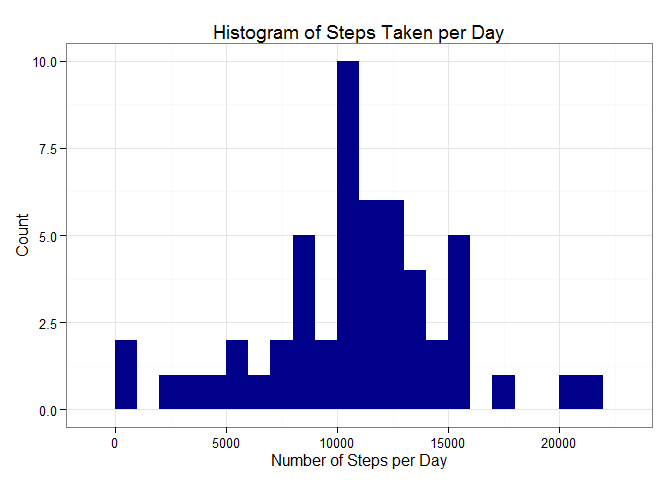
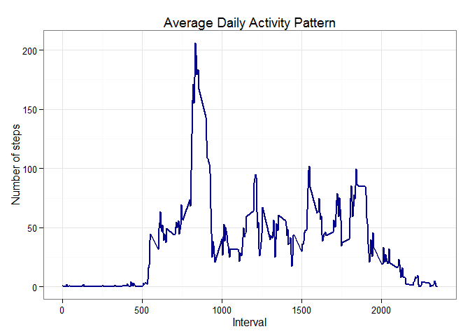
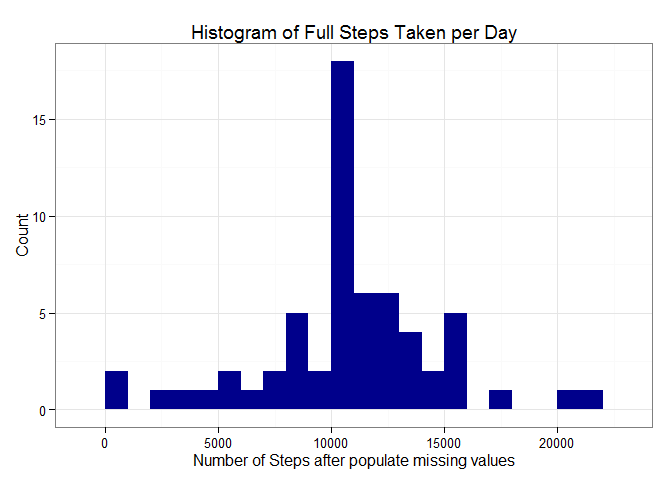

# Reproducible Research: Peer Assessment 1


##Loading & Preprocessing the data

First read the data into R

```r
setwd("~/datasciencecoursera/RepRes/Ass1")
txt_file<- "activity.csv"

data_set <- read.csv(txt_file,
                 header=TRUE,   sep=",",
                 colClasses=c("numeric", "character", "numeric"))
```

Then update the date & interval variable types


```r
data_set$interval <- factor(data_set$interval)
data_set$date <- as.Date(data_set$date, format="%Y-%m-%d")
```


##What is mean total number of steps taken per day?

Create and aggregated dataset (aggregating on the date)

```r
steps_taken_per_day <- aggregate(steps ~ date, data_set, sum)
colnames(steps_taken_per_day) <- c("date", "steps")
```

Plot a histogram of the total number of steps per day


```r
require(ggplot2)
```

```
## Loading required package: ggplot2
```

```r
ggplot(steps_taken_per_day, aes(x = steps)) + 
  geom_histogram(fill = "darkblue", binwidth = 1000) + 
  labs(title="Histogram of Steps Taken per Day", 
       x = "Number of Steps per Day", y = "Count") + 
  theme_bw() 
```

 

Calculate the mean & median total number of steps per day


```r
mean_steps = round(mean(steps_taken_per_day$steps, na.rm=TRUE), 2)
median_steps = round(median(steps_taken_per_day$steps, na.rm=TRUE), 2)
```
The mean number of steps:

```
## [1] 10766
```

The median number of steps:

```
## [1] 10765
```

##What is the average daily activity pattern?

Aggregate the data on interval

```r
steps_per_interval <- aggregate(data_set$steps,by = list(interval = data_set$interval),FUN=mean, na.rm=TRUE)
```


Convert to integers for plotting & plot

```r
steps_per_interval$interval <- 
  as.integer(levels(steps_per_interval$interval)[steps_per_interval$interval])
colnames(steps_per_interval) <- c("interval", "steps")

ggplot(steps_per_interval, aes(x=interval, y=steps)) +   
  geom_line(color="darkblue", size=1) +  
  labs(title="Average Daily Activity Pattern", x="Interval", y="Number of steps") +  
  theme_bw() + theme(legend.position = "bottom")
```

 

Which 5 minute interval on average across all the days in teh dataset contains the maximum number of steps?


```r
max_step_interval <- steps_per_interval[which.max(steps_per_interval$steps),]$interval
max_step_interval
```

```
## [1] 835
```


##Inputing missing values

Calculate the number of missing values in the dataset:


```r
no_missing_values<-sum(is.na(data_set$steps))
no_missing_values
```

```
## [1] 2304
```

Fill in missing data (using mean values of each 5 minute interval)


```r
fill_na <- function(data, defaults) {
  na_indices <- which(is.na(data$steps))
  na_replacements <- unlist(lapply(na_indices, FUN=function(idx){
    interval = data[idx,]$interval
    defaults[defaults$interval == interval,]$steps
  }))
  fill_steps <- data$steps
  fill_steps[na_indices] <- na_replacements
  fill_steps
}

data_fill <- data.frame(  
  steps = fill_na(data_set, steps_per_interval),  
  date = data_set$date,  
  interval = data_set$interval)
```

Aggregate the filled data by date

```r
full_steps_per_day <- aggregate(steps ~ date, data_fill, sum)
colnames(full_steps_per_day) <- c("date", "steps")
```


Plot a histogram of the filled data:

```r
ggplot(full_steps_per_day, aes(x=steps)) + 
  geom_histogram(fill="darkblue", binwidth=1000) + 
  labs(title="Histogram of Full Steps Taken per Day", 
       x="Number of Steps after populate missing values", 
       y="Count") + 
  theme_bw()    
```

 


Calcualte the new mean & median values of total steps per day

```r
full_mean_steps = round(mean(full_steps_per_day$steps), 2)
full_median_steps = round(median(full_steps_per_day$steps), 2)
```
The mean number of steps is

```
## [1] 10766
```
The median number of steps is

```
## [1] 10766
```
The process of replacing missing values with the mean of their 5 minute interval has resulted in very little impact on the mean & median. THe mean remains unchanged, whilst the median is moved by <0.01%


##Are there differences in activity patterns between weekdays and weekends?

Add a factor variable to the dataset with two levels "weekday" & "weekend"


```r
data_fill$weekday<-weekdays(data_fill$date)

for (i in 1:nrow(data_fill)){
  if(data_fill$weekday[i]=="Saturday"||data_fill$weekday[i]=="Sunday"){
     data_fill$weekday[i]<-"weekend"
  }else {
    data_fill$weekday[i]<-"weekday"
  }
}

data_fill$weekday<-as.factor(data_fill$weekday)
```

Aggregate the data on interval (keeping weekday in the resultant dataframe)


```r
averagestepsinterval<-aggregate(steps ~ interval+weekday, data = data_fill, mean)
```

Plot interval against average number of steps for weekdays & weekends in a panel plot:

```r
require(lattice)
```

```
## Loading required package: lattice
```

```r
averagestepsinterval$interval<-as.integer(levels(averagestepsinterval$interval)[averagestepsinterval$interval])
xyplot(steps ~ interval | weekday, averagestepsinterval, type = "l", layout = c(1, 2), 
       xlab = "Interval", ylab = "Number of steps")
```

 

we can see from the above graphs that the subject begins activity earlier on weekdays, but has a lower average  activity level across the day.

